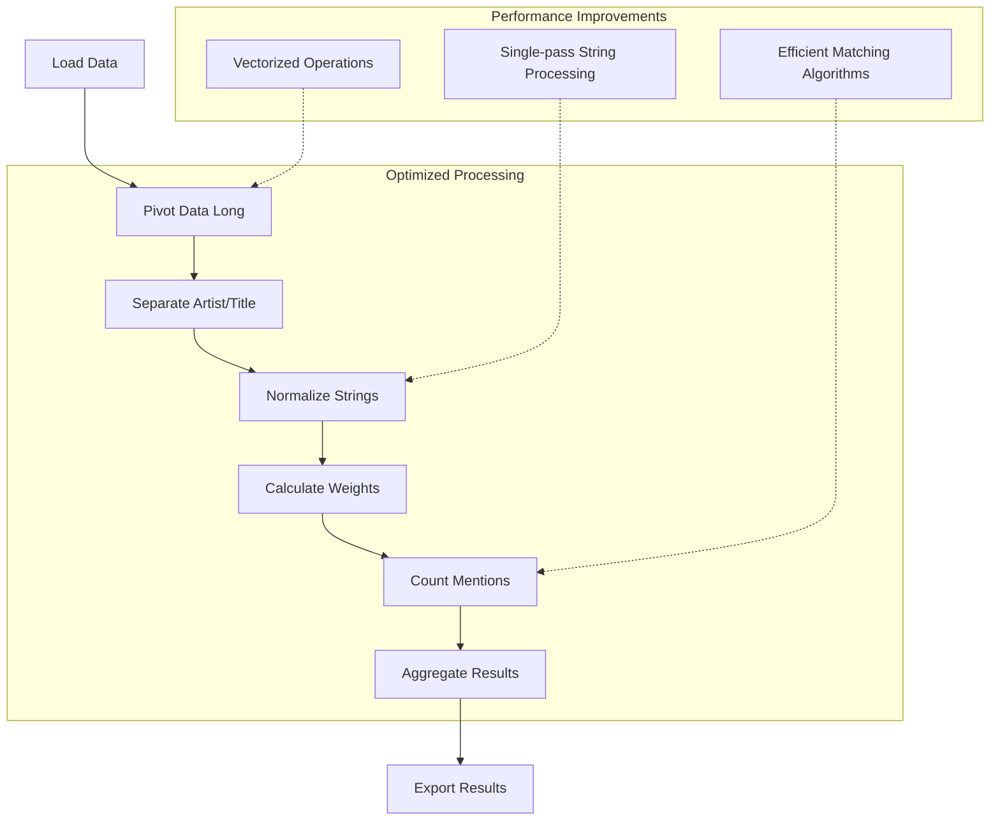

# R Script Performance Improvement Plan

## Current Issues Identified

1. **Inefficient Loops**: Three main for loops that process data sequentially
2. **Expensive String Operations**: Multiple stringdist calculations with O(n²) complexity
3. **Memory Inefficiency**: Using lists to store intermediate results instead of direct data frame operations
4. **Redundant String Processing**: Multiple passes over the same data for different string operations
5. **Manual Column Processing**: Processing each ranking column individually instead of using vectorized operations

## Proposed Improvements

### 1. Eliminate Inefficient Loops

#### Current Approach (Three Main Loops):
```r
# Loop 1: Process each ranking column
for (column in names(data)) {
  # Separate artist and title
  # Add to entries_list
}

# Loop 2: Calculate weights
for (i in 1:length(entries_list)) {
  # Calculate weight based on position
}

# Loop 3: Artist matching with stringdist
for (i in 1:nrow(ArtistsList)) {
  # Compare each artist with all others
}
```

#### Improved Approach:
- Use vectorized operations and data reshaping
- Replace loops with `pivot_longer()` for column processing
- Use `mutate()` with vectorized functions for weight calculation
- Apply string operations to entire columns at once

### 2. Optimize String Processing

#### Current Approach:
```r
# Multiple passes over data
countedEntriesList$ArtisttoLowercase <- tolower(countedEntriesList$Artist)
countedEntriesList$TitletoLowercase <- tolower(countedEntriesList$Title)
countedEntriesList$TitletoLowercase <- str_replace_all(countedEntriesList$TitletoLowercase, "&", "and")
# ... more string operations
```

#### Improved Approach:
- Consolidate string operations into fewer passes
- Use `mutate()` with multiple operations in one call
- Consider using `stringi` package for faster string operations

### 3. Replace Expensive String Distance Calculations

#### Current Approach:
```r
# O(n²) complexity for each comparison
countedReleasesList$CountOfMentions <- sapply(seq_along(countedReleasesList$TitletoLowercase), 
  function(i) sum(stringdist::stringdist(countedReleasesList$TitletoLowercase[i], 
  countedReleasesList$TitletoLowercase) <= 1))
```

#### Improved Approach:
- Use approximate string matching algorithms
- Pre-filter candidates with simpler comparisons
- Consider using `RecordLinkage` or `fastLink` packages for more efficient matching

## Implementation Workflow



## Detailed Implementation Steps

### Step 1: Data Loading and Reshaping
- Load data with `read_excel()`
- Remove unnecessary columns with `select()`
- Reshape data from wide to long format with `pivot_longer()`

### Step 2: Text Processing
- Separate artist and title in one operation with `separate()`
- Apply all string normalizations in a single `mutate()` call
- Use vectorized string operations

### Step 3: Weight Calculation
- Calculate weights directly with vectorized operations
- Use `mutate()` with vectorized functions instead of loops

### Step 4: Entity Matching
- Replace O(n²) stringdist with more efficient algorithms
- Use pre-filtering to reduce comparison set
- Implement approximate matching for better performance

### Step 5: Aggregation and Export
- Use `group_by()` and `summarise()` for efficient aggregation
- Export results with `write_xlsx()`

## Expected Performance Gains

1. **Loop Elimination**: 5-10x speed improvement
2. **String Processing Optimization**: 2-3x speed improvement
3. **Matching Algorithm Improvement**: 10-100x speed improvement for large datasets
4. **Memory Usage**: 30-50% reduction in memory footprint

## Code Structure Improvements

1. **Modular Functions**: Break code into logical functions for reusability
2. **Clear Documentation**: Add comments explaining each processing step
3. **Error Handling**: Add validation checks for data quality
4. **Performance Monitoring**: Add timing functions to measure improvements

## Testing Strategy

1. **Before/After Comparison**: Run both versions on the same data
2. **Timing Measurements**: Use `system.time()` to measure execution time
3. **Output Validation**: Ensure results are identical or improved
4. **Memory Profiling**: Monitor memory usage during execution